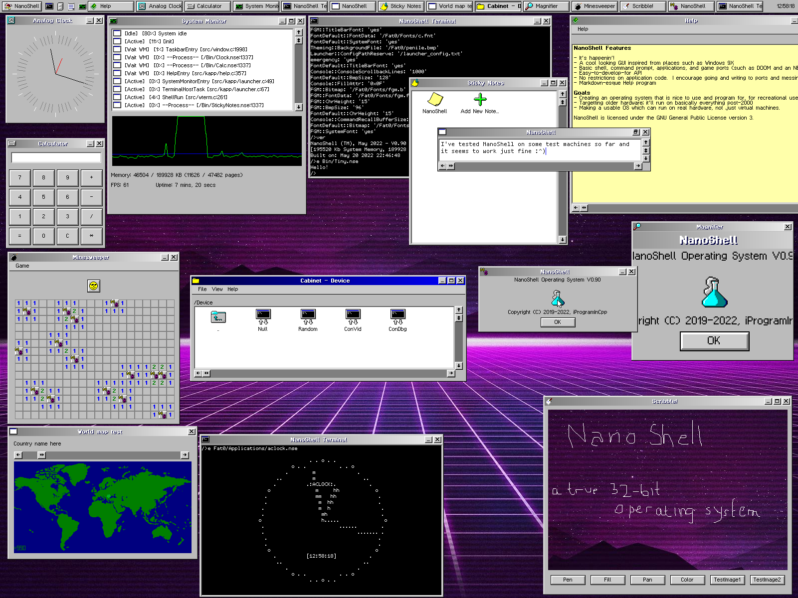
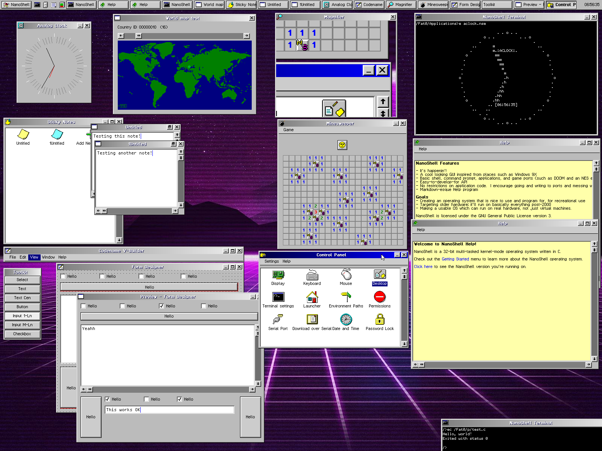
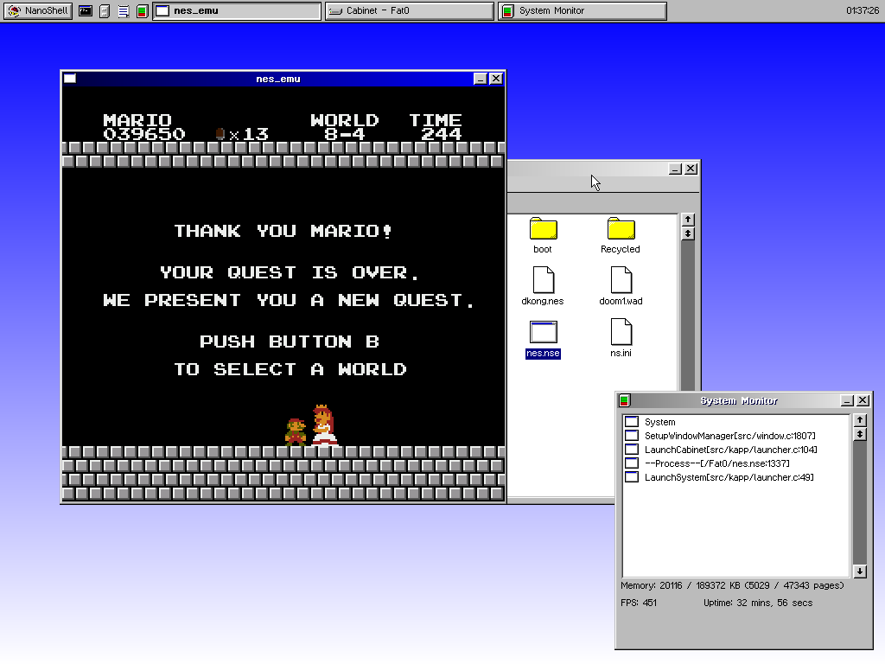

<h1 align="center"> The NanoShell Operating System </h1>

<p align="center">
	
</p>

NanoShell is a preemptively multi-tasked 32-bit operating system with a windowed GUI.

#### Be advised that this is beta-level software and you should not expect any stability from it.

This software is licensed under the GNU General Public License V3 only.

## Demo Screenshots




[More images...](https://github.com/iProgramMC/NanoShellOS/blob/master/images)

## Goals

Note that **user mode** is "mysteriously" absent.  This OS is entirely running in ring-0.
I'm not particularly concerned with safety, any app is free to do anything.  The design is NOT the best, by ANY means, so do not inspire yours from this design.

Feel free to submit issues you may have with this OS in the Issues tab.  To discuss other things, join the [Discord server](https://discord.gg/zP6xZmrnNQ "iProgramInCpp's Tavern").

- [x] Hello World
#### Primordial tasks
- [x] Paging and dynamic memory allocation
- [x] Loading an ELF at some virtual address with its own heap and executing it
- [x] Task Switching (concurrent threads)
#### User
- [x] A basic shell, can execute applications
- [x] Get a GUI running (Also in a task)
- [x] Applications can use the GUI API
- [x] Port DOOM
- [ ] (ultimate boss) Port Mesa and Super Mario 64 (based on the DOS port, please)
#### Drivers
- [x] PS/2 Mouse and Keyboard
- [x] EGA Text mode
- [x] VBE Graphics mode (fast)
- [x] Bochs/QEMU debugcon (E9 hack)
- [X] Serial port
- [ ] PCI
- [X] VirtualBox/QEMU/Bochs graphics device (*not* VBE)
- [ ] VMware SVGA device
- [ ] Sound devices (e.g. SoundBlaster 16)
- [ ] USB
#### Permanent memory
- [x] Block storage abstraction base
- [x] Optional RAM disk images can be loaded and used as block devices
- [ ] ATA device driver
- [ ] USB stick device driver
#### File system
- [x] Root contains several files which are packed neatly into the executable
- [X] Mounting other file systems to the main one
- [ ] Cleaning up after a while of not having used a certain directory page (can't apply to root or ram disks, you know why)

## Build instructions

### Linux build:

The following dependencies are required: `xorriso` `clang` `ld`.  Install them first.  An example of how to install them:
```
sudo apt-get install xorriso clang
```

Then, run `make`.

#### Building an image

To build the image, run the following set of commands:
```
make
make initrd
make limine
make image
```

In the `build` directory, you should now have an `image.iso` that you can mount into your favorite x86 emulator and run.

### Windows build:

It may or may not come back soon.

## Installation

#### GRUB

If you don't have grub2, install it.  It's relatively easy.

Once you have a grub installed on your favorite USB drive, create a `grub.cfg` inside the `grub` directory.
Add the following lines:
```
menuentry "NanoShell" {
	multiboot /boot/kernel.bin root=/
	module    /boot/initrd.tar
	set gfxpayload=1024x768x32
	boot
}
```

**Side note**: if you've installed NanoShell on a FAT32-formatted IDE hard disk you can use `root=/Fat0` (where Fat0 can be swapped out for any FatX device). Also
you may change the gfxpayload to any resolution that GRUB supports.

Note that you can place your kernel image anywhere, but I prefer `/boot/kernel.bin`.  Place your kernel image so that grub can find it, and then restart.

#### Limine
To boot NanoShell using Limine, you can take a look at the example [limine.cfg](limine.cfg).

```
TIMEOUT=3

:NanoShell OS

PROTOCOL=multiboot1

CMDLINE=root=/
KERNEL_PATH=boot:///kernel.bin
MODULE_PATH=boot:///initrd.tar
```

Just like in the grub install example, you can change the root to anywhere.

And you're done! You should be in NanoShell now.  Type `w` to go to the GUI mode.
