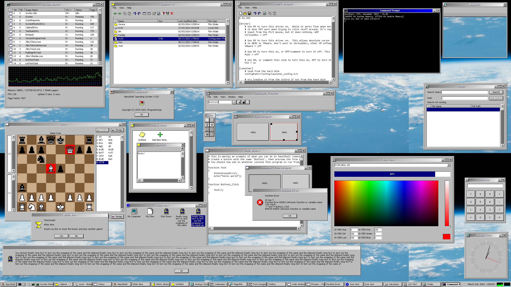
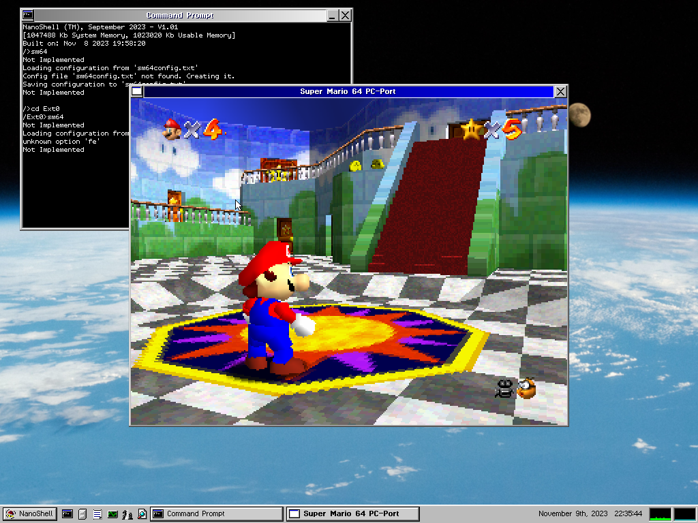
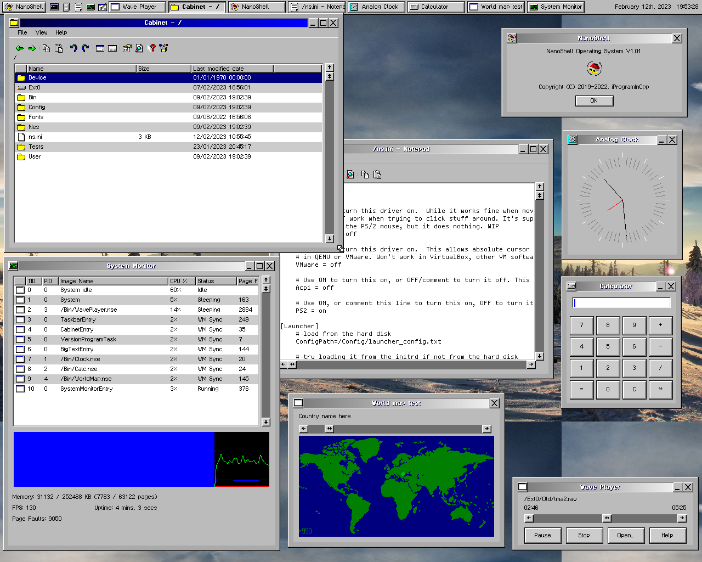
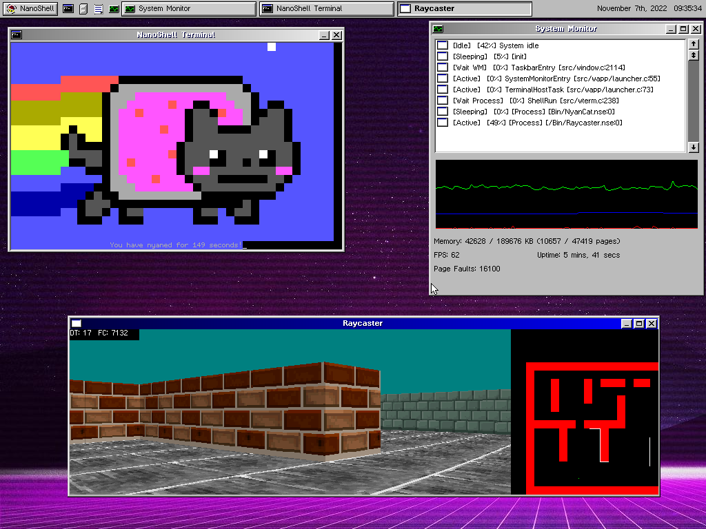

<h1 align="center"> The NanoShell Operating System </h1>

<p align="center">
	
</p>

NanoShell is a preemptively multi-tasked 32-bit operating system with a windowed GUI.

#### Be advised that this is beta-level software and you should not expect any stability from it.

#### NanoShell isn't being actively developed anymore.  While I may come back to it sometimes to work on it, development is currently inactive. For an active OS project, see https://github.com/iProgramMC/Boron

## Third-party attributions

This software is licensed under the GNU General Public License version 3 or later, except in the following components:
* [apps/Doom](apps/Doom) - [CorruptedByCPU/doomgeneric](https://github.com/CorruptedByCPU/doomgeneric) is licensed under the GNU GPL v2.
* [apps/NyanCat](apps/NyanCat) - [klange/NyanCat](https://github.com/klange/nyancat) is licensed under the [NCSA license](https://en.wikipedia.org/wiki/University_of_Illinois/NCSA_Open_Source_License).
* [crt/include](crt/include) - [mintsuki/freestanding-headers](https://github.com/mintsuki/freestanding-headers) is licensed under the [BSD Zero-clause License](https://en.wikipedia.org/wiki/BSD_licenses#0-clause_license_(%22BSD_Zero_Clause_License%22)).

The following third party code is also licensed under the GNU GPL version 3.
* [apps/NesEmu](apps/NesEmu) - [franzflasch/nes_emu](https://github.com/franzflasch/nes_emu)

## Want to contribute?

[Just do it!](https://www.youtube.com/watch?v=ZXsQAXx_ao0) Kidding aside, feel free to make a pull request! (I'd like it even more if you could help me clean up the source!)

[Coding style guidelines](doc/coding_style.md)
[NanoShell C Library info](crt/README.md)

## Screenshots





[More images...](https://github.com/iProgramMC/NanoShellOS/blob/master/images)

## Goals

This OS is entirely running in ring-0. I'm not particularly concerned with safety, as the OS isn't about safety, it's about having fun.
The design is NOT the best, by ANY means, so you probably shouldn't imitate this design.

Feel free to submit issues you may have with this OS in the Issues tab.  To discuss other things, join the [Discord server](https://discord.gg/vs6yw2GtAc "iProgramInCpp's Tavern II").

- [x] Hello World
#### Primordial tasks
- [x] Paging and dynamic memory allocation
- [x] Loading an ELF at some virtual address with its own heap and executing it
- [x] Task Switching (concurrent threads)
- [x] TSC-backed timing (works best on systems with an invariant TSC, but it's not that crappy on older systems, as the TSC recalibrates itself every second)
- [x] FPU and SSE support
#### User
- [x] A basic shell, can execute applications
- [x] Get a GUI running (Also in a task)
- [x] Applications can use the GUI API
- [x] Port DOOM
- [X] Compile C code to an NSE file (I'll probably port TCC to NanoShell)
- [ ] Move all applications that don't depend on features I'm not willing to expose to user applications (i.e. taskbar/systemmonitor will stay)
- [ ] Allow applications to temporarily upload and use their own resources in the kernel (icons, text, images etc)
#### Drivers
- [x] PS/2 Mouse and Keyboard
- [x] EGA Text mode
- [x] VBE Graphics mode (fast)
- [x] Bochs/QEMU debugcon (E9 hack)
- [x] Serial port
- [x] PCI (Barebones support right now)
- [x] VirtualBox/QEMU/Bochs graphics device (*not* VBE)
- [x] VMware absolute cursor
- [X] SoundBlaster 16 support
- [ ] Sound devices (e.g. AC'97, Intel HD Audio)
- [ ] VirtualBox absolute cursor
- [ ] VMware SVGA device
#### Permanent memory
- [x] Block storage abstraction base
- [x] ATA devices (PIO mode)
- [ ] ATA devices (using DMA)
- [ ] AHCI devices (using DMA)
- [ ] NVMe?
#### File system
- [x] EXT2:
- [x] \*        Read only support.
- [x] \*        Expand a file.
- [x] \*        Shrink a file.
- [x] \*        Write data to a file.
- [x] \*        Create a file entry.
- [x] \*        Rename a file entry.
- [x] \*        Unlink a file.
- [x] \*        Create a directory.
- [x] \*        Remove an empty directory.
- [x] \*        Do all these things with flying colors from `e2fsck`.
- [ ] FAT32:
- [ ] \*        Read only support.
- [ ] \*        Expand a file.
- [ ] \*        Shrink a file.
- [ ] \*        Write data to a file.
- [ ] \*        Create a file entry.
- [ ] \*        Rename a file entry.
- [ ] \*        Delete a file.
- [ ] \*        Create a directory.
- [ ] \*        Remove an empty directory.
- [ ] \*        Do all these things with flying colors from `chkdsk`.
#### Completed 'future'
- [X] Port Super Mario 64

#### The future
- [ ] An installer, which deploys [Limine](https://github.com/limine-bootloader/limine) onto a system, creates a FAT32 (or EXT2?) file system and creates a working installation of NanoShell
- [ ] An in-built IDE (which depends on the compiler thing I mentioned earlier)
- [ ] USB stack
- [ ] USB keyboard
- [ ] USB mouse
- [ ] USB stick device driver

## Build instructions

### Linux:

The following dependencies are required: `xorriso` `clang` `ld`.  Install them first.  An example of how to install them:
```
sudo apt-get install xorriso clang
```

Then, run `make`.

(Note: you can use `NCC=<compiler>`, `NAS=<assembler>` or `NLD=<linker>` to build NanoShell with different versions of clang, nasm or ld)

#### Building an image

To build the image, run the following set of commands:
```
make
make initrd
make limine
make image
```

In the `build` directory, you should now have an `image.iso` that you can mount into your favorite x86 emulator and run.

#### Building NanoShell applications

Should you wish to build NanoShell applications as well, you will also have to do the following command:
```
make -C tools
```

Afterwards, you can `cd apps/<whatever>` and simply type `make`. You will have to copy the resulting \*.nse over by yourself, though.

### Windows:

It may or may not come back soon.

## Installation

#### GRUB

If you don't have grub2, install it.  It's relatively easy.

Once you have a grub installed on your favorite USB drive, create a `grub.cfg` inside the `grub` directory.
Add the following lines:
```
menuentry "NanoShell" {
	multiboot /boot/kernel.bin root=/ emergency=no
	module    /boot/initrd.tar
	set gfxpayload=1024x768x32
	boot
}
```

**Side note**: if you've installed NanoShell on a FAT32-formatted IDE hard disk you can use `root=/Fat0` (where Fat0 can be swapped out for any FatX device). Also
you may change the gfxpayload to any resolution that GRUB supports.

Note that you can place your kernel image anywhere, but I prefer `/boot/kernel.bin`.  Place your kernel image so that grub can find it, and then restart.

#### Limine
To boot NanoShell using Limine, you can take a look at the example [limine.cfg](limine.cfg).

```
TIMEOUT=3

:NanoShell OS

PROTOCOL=multiboot1

CMDLINE=root=/ emergency=no
KERNEL_PATH=boot:///kernel.bin
MODULE_PATH=boot:///initrd.tar
```

Just like in the grub install example, you can change the root to anywhere.

And you're done! You should be in NanoShell now.
If you are in emergency text mode (another parameter in the CMDLINE: `emergency=yes`), the command `w` takes you to the GUI.

## Running

#### QEMU

NanoShell works on QEMU version 6.2.0 with TCG, though I'm pretty sure it also works on earlier versions too.

NanoShell does **not** work on QEMU version 6.2.0 with WHPX enabled.

#### VirtualBox

NanoShell works on VirtualBox version 6.0 - 6.1 for sure, though I'm pretty sure it also works on earlier versions too.

The OS works best with VT-x/AMD-V enabled. Hyper-V performance in VirtualBox is very slow even on Windows.
It's best to turn OFF Hyper-V/Virtual Machine Platform on Windows.

#### VMware

I've only done one VMware test, but it should work fine on there too.

#### Real Hardware

My main testing box is a computer with an Intel Core 2 CPU and 2 GB of RAM (reported 512 MB though).  It works just fine,
although you will need a real PS/2 mouse (a USB mouse will **not** work, yet), and a real PS/2 keyboard (I haven't done
any testing whether USB keyboards also work with PS/2 emulation, but I like to be on the safe side and use both.)

Because it works on QEMU with TCG on my machine (which is a software emulator), I think it'll work on slower machines too.

## Image Credits

The provided background images are not mine. Here is a list of their sources. Note that I do not endorse the content on the sites and
the links are only provided for reference purposes.

* [fs/Res/Backgrounds/Snowy.png](https://wallhere.com/en/wallpaper/613106) - WallHere.com
* [fs/Res/Backgrounds/Space.png](https://spaceref.com/space-stations/space-station-view-waxing-gibbous-moon-above-the-pacific-ocean/) - NASA

